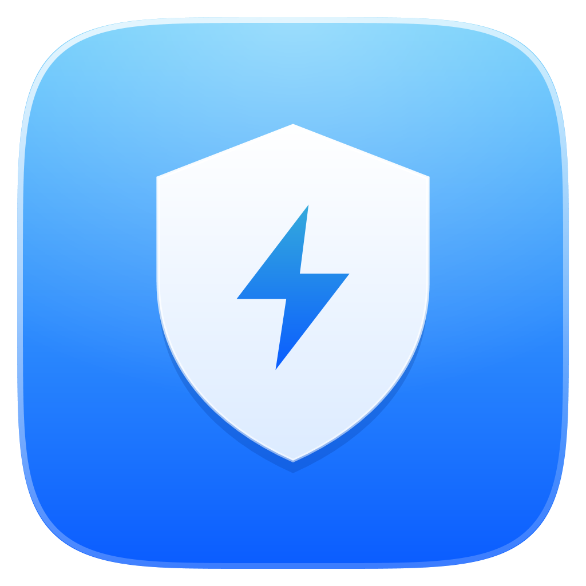

<p align="center"></p>

<h1 align="center">Safe Background Task Killer</h1>

<p align="center">Free up memory on Windows by closing apps that are running in the background, while anything you have open on screen stays untouched.<br>With a clear <b>Liquid Glass</b> interface inspired by Apple's macOS Tahoe.</p>

---

## Install (1 minute)

1. **Download**: click the green **Code** button → **Download ZIP**, then unzip it anywhere (for example `Documents\Safe Background Task Killer`).
2. **Double-click `Install.cmd`**. It creates the shortcuts:
   - **Safe Background Task Killer**: the dashboard (Desktop + Start Menu)
   - **Safe Background Task Killer (Quick Purge)**: one click, no window, shows a small summary
3. Open **Safe Background Task Killer** and click **Purge**.

Windows asks for administrator permission when the dashboard opens. Allow it so background *services* (Razer, Office Click-to-Run, etc.) can be stopped too. Choosing *No* still works; it just skips services.

To remove the shortcuts, run `Install.cmd -Uninstall`, then delete the folder.

**Requirements:** Windows 10 or 11. Everything it needs is built into Windows: PowerShell 5.1 and .NET Framework 4.8. No downloads and no installers.

## How it decides what is safe

- **Protected:** every app with a window on screen or in the taskbar, including all of its helper processes. If Chrome is open, every Chrome process is kept.
- **Protected:** core Windows processes (Explorer, the desktop window manager, security, audio, input, drivers) and developer tools listed in the scripts.
- **Protected:** anything you add to `whitelistProcesses` in **`targets.json`** (use the process name without `.exe`).
- **Closed by Purge:** everything else running in your session without a visible window (tray apps, updaters, launchers, helpers), plus known background bloat such as Razer, Office Click-to-Run and Gigabyte utilities.

> ⚠️ Purge closes background apps immediately, like *End task*. Anything unsaved in an app that only lives in the tray can be lost. Add apps you always want running to `targets.json`.

**Try it safely first:** run the dashboard in simulation mode. It shows exactly what *would* be closed and closes nothing:

```powershell
powershell -ExecutionPolicy Bypass -File .\KillBackgroundApps_GUI.ps1 -WhatIf
```

## The dashboard

- **Reclaimable memory** ring: how much RAM the background apps use right now.
- **Background / Protected** tabs: every app with its real icon and name. Hover a row to end just that app.
- **Purge**: closes all background apps and tells you how much memory was freed.
- **Light and dark mode** follow Windows automatically. Force one with `-Theme Light` or `-Theme Dark`.
- **Shortcuts:** `Ctrl+R` / `F5` rescan, `Ctrl+1` / `Ctrl+2` switch tabs, `Ctrl+,` edit `targets.json`, `Esc` close.

## Liquid Glass

The window is a clear pane of glass: whatever is behind it shows through. Its edges catch the light with specular highlights. The floating controls (the Purge button, the toolbar capsule, the tab selector and notifications) are real refracting glass, drawn by a small pixel shader that bends the content beneath them toward the rim, like Apple's Liquid Glass. The shader is compiled at launch with Windows' own `d3dcompiler_47.dll`. If the graphics card can't run it (for example over Remote Desktop), everything falls back to simple frosted glass.

## Files

| File | What it is |
| --- | --- |
| `Install.cmd` / `Install.ps1` | Creates or removes the shortcuts |
| `KillBackgroundApps_GUI.ps1` | The dashboard |
| `KillBackgroundApps.ps1` | Quick Purge (no window) plus its notification. Options: `-WhatIf`, `-NoPopup`, `-Quiet` |
| `LiquidGlass.cs` | The glass rendering engine. It is compiled once into `%LOCALAPPDATA%\ProcessPurge` so later launches are fast |
| `targets.json` | Your own never-close list (`whitelistProcesses`) |
| `run_app.vbs`, `run_gui.vbs`, `run_silent.vbs` | Silent launchers used by the shortcuts |

## Privacy

It runs entirely on your PC. No internet access, no telemetry, nothing is sent anywhere.

## License

[MIT](LICENSE). Free to use, change and share.
